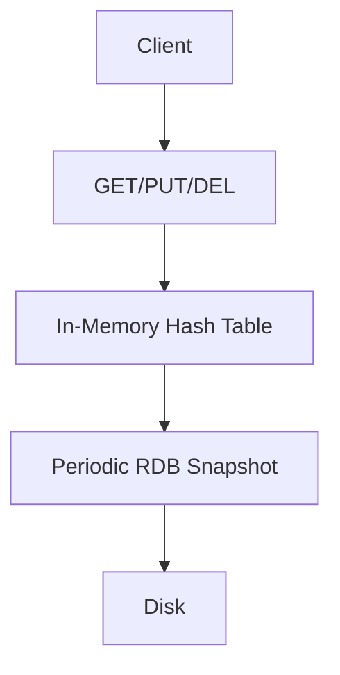
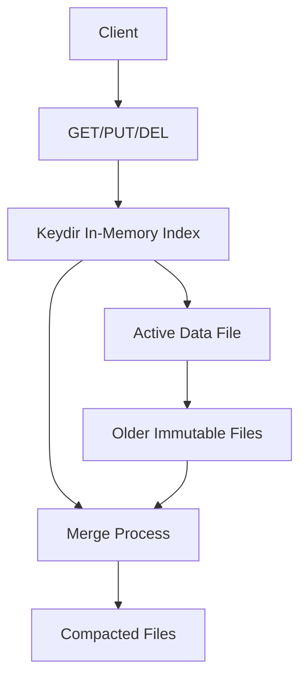

# 


# hoardhaven: 🚀 KV Store Project (Redis-Inspired & Bitcask Hybrid)

**A high-performance single-node persistent KV store with O(1) operations**

  
*(Conceptual diagram showing memory-disk interaction)*

## 🌟 Project Overview

This project implements two approaches to a persistent key-value store:

1. **Redis-style in-memory store** with periodic disk persistence
2. **Bitcask-inspired hybrid model** combining memory efficiency with disk durability

Both implementations target O(1) complexity for GET, PUT, and DEL operations while optimizing hardware usage.

## 📋 Core Features

### ✅ Implemented
- **Basic KV Operations**: GET, PUT, DEL with O(1) complexity
- **In-Memory Redis-style**:
  - Hash-table based storage
  - Periodic snapshot persistence
  - Background saving
- **Bitcask Hybrid**:
  - Log-structured append-only data files
  - In-memory keydir (hash table) for O(1) access
  - Active file rotation
- **Thread-safe operations** with minimal locking
- **Crash recovery** mechanisms

### 🚧 TODO (Help Wanted!)
- [ ] Complete Bitcask merge/compaction
- [ ] Implement hint files for faster startup
- [ ] Benchmarking suite
- [ ] TTL support for keys
- [ ] Bitcask file sync strategies
- [ ] Memory-mapped file support
- [ ] Write-ahead logging for Redis-style
- [ ] Performance optimization
- [ ] CLI interface
- [ ] HTTP API layer

## ⚙️ How It Works

### Redis-Style Implementation

### Bitcask Implementation

## 🛠️ Installation & Usage
### Prerequisites

- Go 1.20+
- Linux/Unix system (for file operations)
```bash
# Clone the repository
git clone https://github.com/yourusername/kv-store.git
cd kv-store

# Build both implementations
make build

# Run Redis-style implementation
./bin/redis-style -port 6379

# Run Bitcask implementation
./bin/bitcask -dir ./data
```

### Configuration Options
#### Redis-Style

- port: Listening port (default: 6379)

- save-interval: Snapshot interval in seconds (default: 60)

#### Bitcask:

- dir: Data directory (default: ./data)

- max-file-size: Active file size limit in MB (default: 1024)

### 📊 Performance Characteristics

|Operation	|Redis-Style	|Bitcask Hybrid|
|---------| ------------| --------|
|GET	|O(1)	|O(1)|
|PUT	|O(1)	|O(1) append|
|DEL	|O(1)	|O(1) + tombstone|
|Startup	|Fast	|Moderate (depends on hint files)|
|Durability	|Periodic	|Immediate (configurable)|


### 🏗️ System Design
#### Core Components
1. Memory Index: Hash table for O(1) access

2. Disk Storage:

 - Redis: Periodic compressed snapshots

 - Bitcask: Append-only log files + merge process

3. Concurrency Control: Fine-grained locking

#### Scaling Considerations
- Vertical Scaling: Limited by RAM for keydir/index

- Horizontal Scaling: Not supported (single-node)

- Cost Efficiency: Bitcask uses disk efficiently for large datasets

#### Failure Handling
- Redis-style: May lose recent writes between snapshots

- Bitcask: Crash-safe due to append-only design

### 📈 Capacity Planning
1. Memory: ~30 bytes per key in keydir

2. Disk:

 - Redis: Full dataset snapshots

 - Bitcask: Write amplification during merge

3. Throughput: Disk speed limits write throughput


## 🌱 Future Improvements
1. Distributed Extension: Raft consensus for multi-node

2. Tiered Storage: Hot/cold key separation

3. Compression: For both memory and disk

4. Observability: Metrics and logging